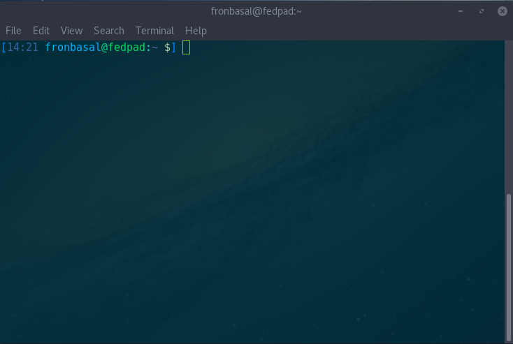

# Colors

## Installation:
```bash
bash <(curl -s https://gist.githubusercontent.com/fronbasal/ca6ac7cc716e7df7f693fe77fa1268a0/raw/b07c58386d2714e0479bdd13843ad401e5293852/colors.sh)
# or
wget -O - https://gist.githubusercontent.com/fronbasal/ca6ac7cc716e7df7f693fe77fa1268a0/raw/b07c58386d2714e0479bdd13843ad401e5293852/colors.sh | bash
```
